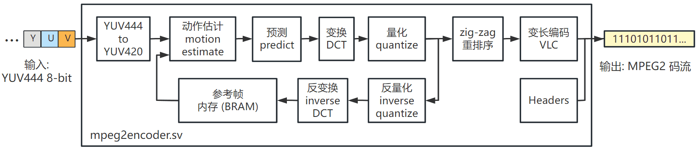

-9A90FD.svg)   

[English](#en) | [中文](#cn)

　

<span id="en">FPGA MPEG2 video encoder</span>
===========================

High performance MPEG2 encoder for video compression.



* **Input**: YUV 444 raw pixels
  * The most convenient input order: frame by frame, row by row, column by column.
  * Adjacent 4 pixels can be input per cycle without backpressure handshake (pixels can be input in any cycle without pause).
* **Output** MPEG2 stream. Once it is stored in a file, it can be opened and viewed using media players, e.g. VLC Media Player 3.0.18
* **Code compatibility**: Written in pure Verilog2001, universal for various FPGA platforms.
* **Performance** ：
  * 4 pixels input per cycle
  * 67 MHz maximum clock frequency on Xilinx Kintex-7 XC7K325 TFFV676-1
  * The throughput reaches 67 * 4 = **268 MPixels/s**. The encoding frame rate for 1920x1152 video is 121 fps.
* **Resource consumption**：
  * **No external memory required**
  * Typical configuration consumes **134k LUT**, on Xilinx 7 Series FPGAs
* **Static adjustable parameters** (not adjustable after deployment):
  * Maximum width and height of the supported video: the larger, the more BRAM it consumes
  * The larger the search range of action estimation is, the higher the compression rate is, but the more LUT is consumed.
  * Quantization level: The higher the level, the higher the compression rate, but the worse the output video quality
* **Dynamic adjustable parameters** (adjustable at runtime for each video sequence):
  * Video width and height
  * I-frame interval (the number of P-frames between two I-frames): The larger, the higher the compression ratio.

　

# Module Usage

[RTL/mpeg2encoder.v](./RTL/mpeg2encoder.v) Is the top module of the MPEG2 encoder (single module design, no sub-modules).

Its parameters and ports are as follows:


```verilog
module mpeg2encoder #(
    parameter  XL           = 6,   // determine the max horizontal pixel count.  4->256 pixels  5->512 pixels  6->1024 pixels  7->2048 pixels .
    parameter  YL           = 6,   // determine the max vertical   pixel count.  4->256 pixels  5->512 pixels  6->1024 pixels  7->2048 pixels .
    parameter  VECTOR_LEVEL = 3,   // motion vector range level, must be 1, 2, or 3. The larger the XL, the higher compression ratio, and the more LUT resource is uses.
    parameter  Q_LEVEL      = 2    // quantize level, must be 1, 2, 3 or 4. The larger the Q_LEVEL, the higher compression ratio and the lower quality.
) (
    input  wire        rstn,                     // =0:async reset, =1:normal operation. It MUST be reset before starting to use.
    input  wire        clk,
    // Video sequence configuration interface. --------------------------------------------------------------------------------------------------------------
    input  wire [XL:0] i_xsize16,                // horizontal pixel count = i_xsize16*16 . valid range: 4 ~ 2^XL
    input  wire [YL:0] i_ysize16,                // vertical   pixel count = i_ysize16*16 . valid range: 4 ~ 2^YL
    input  wire [ 7:0] i_pframes_count,          // defines the number of P-frames between two I-frames. valid range: 0 ~ 255
    // Video sequence input pixel stream interface. In each clock cycle, this interface can input 4 adjacent pixels in a row. Pixel format is YUV 4:4:4, the module will convert it to YUV 4:2:0, then compress it to MPEG2 stream. 
    input  wire        i_en,                     // when i_en=1, 4 adjacent pixels is being inputted,
    input  wire [ 7:0] i_Y0, i_Y1, i_Y2, i_Y3,   // input Y (luminance)
    input  wire [ 7:0] i_U0, i_U1, i_U2, i_U3,   // input U (Cb, chroma blue)
    input  wire [ 7:0] i_V0, i_V1, i_V2, i_V3,   // input V (Cr, chroma red)
    // Video sequence control interface. --------------------------------------------------------------------------------------------------------------------
    input  wire        i_sequence_stop,          // use this signal to stop a inputting video sequence
    output wire        o_sequence_busy,          // =0: the module is idle and ready to encode the next sequence. =1: the module is busy to encode the current sequence
    // Video sequence output MPEG2 stream interface. --------------------------------------------------------------------------------------------------------
    output wire        o_en,                     // o_en=1 indicates o_data is valid
    output wire        o_last,                   // o_en=1 & o_last=1 indicates this is the last data of a video sequence
    output wire[255:0] o_data                    // output mpeg2 stream data, 32 bytes in LITTLE ENDIAN, i.e., o_data[7:0] is the 1st byte, o_data[15:8] is the 2nd byte, ... o_data[255:248] is the 32nd byte.
);
```

　

## Module parameters

The parameters of the mpeg2encoder module are as follows **Table 1**.

**Table 1** : *Description of module parameters*

|     parameter     | valid range |Explain|
| :------------: | :------: | ------------------------------------------------------------ |
|      `XL`      | 4,5,6,7  |The maximum width of the video that the module can encode. 4- > 256 pixels, 5- > 512 pixels, 6- > 1024 pixels, 7- > 2048 pixels. Larger consumes more BRAM resource|
|      `YL`      | 4,5,6,7  |The maximum height of the video that the module can encode. 4- > 256 pixels, 5- > 512 pixels, 6- > 1024 pixels, 7- > 2048 pixels. Larger consumes more BRAM resource|
| `VECTOR_LEVEL` |  1,2,3   |Search range for motion estimate, 1- > 2 pixels, 2- > 4 pixels, 3- > 6 pixels. Larger means higher compression ratio, but consumes more LUT resources|
|   `Q_LEVEL`    | 1,2,3,4  |The higher the quantization level, the higher the compression rate, but the worse the output video quality|

:warning:  Before using this module, you need to decide `XL` and `YL` according to the size of the video you want to compress. For example, if you want to encode 1920x1152 video, you should choose `XL=YL=7` at-least. If you only want to encode 640x480 video, of course, you can also take `XL=YL=7` it, but to save BRAM resources, you can take it `XL=6, YL=5`.

　

## Module interface

All signals are synchronous with `clk` 's rising edge of (the input signal should be updated on `clk` 's rising edge, and the output signal needs to be sampled on clk` 's rising edge) , except `rstn` that the signal is asynchronous reset.

### Module reset

 `rstn` It is asynchronous reset, `rstn=0` reset and `rstn=1` release reset of this module. After the FPGA is powered up, before using the module, **Must! Must! At least one reset must be performed**. No reset is required during normal operation. Of course, if you want to, you can also reset, and all the States of the module will be restored to the initial state.

### Input pixels

To use this module to encode a **Video sequence** sequence (a series of frames), the pixels need to be input into the module in the order of frame by frame, row by row, and column by column. Adjacent 4 pixels in the same row can be input per clock cycle.

When user want to input once, set `i_en=1` , and 4 adjacent pixels must appear on `i_Y0, i_Y1, i_Y2, i_Y3, i_U0, i_U1, i_U2, i_U3, i_V0, i_V1, i_V2, i_V3` .

Where `i_Y0, i_U0, i_V0` are Y, U, V values of the 1st pixel, `i_Y1, i_U1, i_V1` are Y, U, V values of the 2nd pixel, ...

For example, a 64 x64 video sequence is as follows. Where `(Yijk, Uijk, Vijk)` represents the Y, U, V values of the pixel in the ith frame, jth row, and kth column:


```
frame0：
  row0： (Y000, U000, V000), (Y001, U001, V001), (Y002, U002, V002), (Y003, U003, V003), (Y004, U004, V004), (Y005, U005, V005), (Y006, U006, V006), (Y007, U007, V007), (Y008, U008, V008), (Y009, U009, V009), ..., (Y0063, U0063, V0063)
  row1： (Y010, U010, V010), (Y011, U011, V011), (Y012, U012, V012), (Y013, U013, V013), (Y014, U014, V014), (Y015, U015, V015), (Y016, U016, V016), (Y017, U017, V017), (Y018, U018, V018), (Y019, U019, V019), ..., (Y0163, U0163, V0163)
  ...
frame1：
  row0： (Y100, U100, V100), (Y101, U101, V101), (Y102, U102, V102), (Y103, U103, V103), (Y104, U104, V104), ...
  row1： (Y110, U110, V110), (Y111, U111, V111), (Y112, U112, V112), (Y113, U113, V113), (Y114, U114, V114), ...
  ...
...
```

The first clock cycle should input the first four pixels of frame 0, line 0:


```
1st clock cycle:
i_Y0 = Y000
i_Y1 = Y001
i_Y2 = Y002
i_Y3 = Y003
i_U0 = U000
i_U1 = U001
i_U2 = U002
i_U3 = U003
i_V0 = V000
i_V1 = V001
i_V2 = V002
i_V3 = V003
```

The next cycle should then:


```
2nd clock cycle
i_Y0 = Y004
i_Y1 = Y005
i_Y2 = Y006
i_Y3 = Y007
i_U0 = U004
i_U1 = U005
i_U2 = U006
i_U3 = U007
i_V0 = V004
i_V1 = V005
i_V2 = V006
i_V3 = V007
```

By analogy, it take 64/4 = 16 clock cycles to input row 0 of frame 0, and then that 17th clock cycle should input the first 4 pixel of frame0, row1 :


```
17th clock cycle
i_Y0 = Y010
i_Y1 = Y011
i_Y2 = Y012
i_Y3 = Y013
i_U0 = U010
i_U1 = U011
i_U2 = U012
i_U3 = U013
i_V0 = V010
i_V1 = V011
i_V2 = V012
i_V3 = V013
```

Continuing with this analogy, it takes 64 \* 64/4 = 1024 clock cycles to complete frame 0, and then the 1025th clock cycle should input the first 4 pixels of frame1, row0 :


```
1025th clock cycle
i_Y0 = Y100
i_Y1 = Y101
i_Y2 = Y102
i_Y3 = Y103
i_U0 = U100
i_U1 = U101
i_U2 = U102
i_U3 = U103
i_V0 = V100
i_V1 = V101
i_V2 = V102
i_V3 = V103
```

:warning:  This module **can continuously input 4 pixels per cycle without stall (no input back pressure handshake).** However, **Pixels may also be input intermittently when the sender does not have the pixels ready** , that is, let `i_en=0`.

### Input video's meta-information

When inputting the first 4 pixels of a video sequence (i.e., the first 4 pixels of frame0, row0), you should make `i_xsize16` , `i_ysize16` ,`i_pframes_count`  valid, where:

-   `i_xsize16` is video width/16. e.g., for 640x480 video, take `i_xsize16 = 640/16 = 40`. Note that `i_xsize16` the value range is `4~(2^XL)`.
-   `i_ysize16` is video width/16. e.g., for 640x480 video, take `i_xsize16 = 480/16 = 30`. Note that `i_ysize16` the value range is `4~(2^YL)`.
-  `i_pframes_count` Determines the number of P frames between two adjacent I frames. `0~255` The larger the number, the higher the compression rate. The recommended value is 23.

:warning:  This module only supports videos that are multiples of 16 in both width and height, such as 1920x1152. If the width and height of the video is not 16, it should be pad into multiple of 16 before being sent to this module. For example, a 1910x1080 video should be padded to 1920x1088.

:warning:  This module does not support videos with width and height less than 64, so the least legal value of `i_xsize16`  and `i_ysize16` is 4.

### Ends the current video sequence

When several frames are input **If you want to end the current video sequence (there is no limit to the number of frames in a video sequence), you need to send a "end the current video sequence" request to the module**, the specific method is to `i_sequence_stop=1` maintain a period, either of the following two ways:

- While inputting the last 4 pixels of the video sequence `i_sequence_stop=1`;
- After a number of cycles following the input of the last 4 pixels of the video sequence `i_sequence_stop=1`.

Then it is necessary to wait for the module to finish the video sequence by detecting `o_sequence_busy` the signal that `o_sequence_busy=1` the delegate module is encoding a sequence; `o_sequence_busy=0` the delegate module is idle. When you send the "end the current video sequence" request, you should wait for `o_sequence_busy` the change `0` from `1` to, which means that the encoding of the video sequence has been completely completed.

### Start entering the next video sequence

When the previous video sequence is completely finished ( `o_sequence_busy` change from `1` to `0`), the next video sequence can be input (that is, input the first four pixels of the next video sequence. At the same time, let `i_xsize16`, `i_ysize16`, `i_pframes_count` valid).

### Output MPEG2 code stream

 `o_en`, `o_last`, `o_data` These three signals are for outputting the encoded MPEG2 bitstream.

When `o_en=1` , 32 bytes of MPEG2 stream data will appear on  `o_data`  .

When `o_en=1`  . If `o_last=1`, it means that this is the last data of the video sequence, and the first data of the next video sequence will be output next time when `o_en=1`.

> :warning: `o_data` is **Little Endian**, `o_data[7:0]` ist the first byte, `o_data[15:8]` the second byte... `o_data[255:248]` Is the last byte. Little endian is used because most buses are also little endian (for example, the AXI bus).

>  When a module is idle (i.e. `o_sequence_busy=0`), it cannot output data (`o_en=1` is impossible)

　

## Example waveforms

To summarize the above description, an example **Figure 1** of the operating waveform of the module is given, in which the gray waveform represents the don't care (which can take any value without affecting anything).

||
| :---------------------------------: |
|**Figure 1**: Example Waveform for Module|

　

　

# Deploy result

**Table 2** It shows the FPGA resource usage by the module when taking different `VECTOR_LEVEL` parameters. The FPGA is Xilinx Kintex-7 **XC7K325TFFV676-1**.

**Table 2** : *Resource consumption of this module on XC7K325TFFV676-1*

|      | `VECTOR_LEVEL=1, XL=YL=6`| `VECTOR_LEVEL=2, XL=YL=6` | `VECTOR_LEVEL=3, XL=YL=6` |
| :----------: | :-----------------------: | :-----------------------: | :-----------------------: |
|     LUT      |           87964           |          106861           |          134988           |
|      FF      |           63468           |           69568           |           76677           |
|    DSP48E    |            125            |            125            |            125            |
|   BRAM36K    |            405            |            405            |            405            |
| max clock freq. |67 MHz|          67 MHz           |          67 MHz           |

　

　

# Simulation

The files related to the simulation are in the [SIM](./SIM) directory, where:

- tb_mpeg2encoder.v is a testbench for mpeg2encoder.v, which can read the original pixels of three video sequences from the three original pixel files, and send them to the mpeg2encoder according to the waveform in **Figure 1**. And writes its output stream to files (.m2v file). You can use VLC Media Player 3.0.18 to open these.m2v files.
- tb_run_iverilog.bat is a command script to run simulation using iverilog.
- data.zip contains the raw pixels of 3 videos I provided to be compressed, which will be read by tb_mpeg2encoder.v.

　

## Prepare YUV files (raw pixel files)

The testbench needs to input original video pixels to mpeg2encoder, but most videos is already encoded (it is basically impossible to have a video stored in the original pixels), so before simulation, you need to prepare YUV files (original pixel file). The testbench can then read the file and feed pixels into [mpeg2encoder](./RTL/mpeg2encoder.v) module.

### Format of YUV files

We specify that YUV files store each frame of a video in sequence, with Y U V three components of each frame stored separately.

For example, for a 128x64 video (8192 pixels per frame), the file's:

- The first 8192 bytes hold all Y pixels of frame0
- The next 8192 bytes hold all U pixels of frame1
- The next 8192 bytes hold all V pixels of frame1
- The next 8192 bytes hold all Y pixels of frame1
- The next 8192 bytes hold all U pixels of frame1
- The next 8192 bytes hold all V pixels of frame1
- ......

### Use the YUV file I provided

I provided three YUV files corresponding to the video, and you can get them by unzipping [data.zip](./SIM/data.zip).

you can get 288x208.yuv , 640x320.yuv and 1440x704.yuv . They are actually decoded from 288x208.mp4, 640x320.mp4 and 1440x704.mp4.

### Use ffmpeg to convert more videos to YUV files

If you want to simulate other videos, you can use ffmpeg (a video encode/decode tool) to convert video files to YUV files.

First, install ffmpeg.

If you use Windows, Download ffmpeg on https://ffmpeg.org/

If you use Linux, use following command to install ffmpeg:


```bash
apt-get install ffmpeg
```

Then, for example, if you want to convert a video file `a.mp4` to a YUV file `a.yuv`, you need to run command:


```bash
ffmpeg -i "a.mp4" -pix_fmt yuv444p "a.yuv"
```

　

## Run the simulation

After unzipping the data.zip, a directory called 'data' will appear under the SIM directory, which contains YUV files. Then we can run simulation.

### Use iverilog to simulate

Before using iverilog for simulation, you need to install iverilog, see: [iverilog_usage](https://github.com/WangXuan95/WangXuan95/blob/main/iverilog_usage/iverilog_usage.md)

Then double-click the tb_run_iverilog.bat to run simulation (Windows only).

### Use other simulators

You need to add the tb_mpeg2encoder.v and mpeg2encoder.v to a simulation project. Then set tb_mpeg2encoder.v as top.

Then modify the line 25\~41 of tb_mpeg2encoder.v to specify the path of input YUV  file, the path of the output MPEG2 video file (.m2v), and the width and height of each video.

Here I use the relative path of the 3 videos by default. **Note that some simulators do not support relative paths, so you have to use absolute paths instead.**

Then you may also need to configure parameters `XL` and `YL` on line 23, according to the description in **Table 1**.

Then you can start running the simulation.

### Verify the simulation results

This simulation takes a long time (probably several hours for compressing the 3 YUV files I provided).

When all three videos have been encoded, it will encounter `$finish` to finish simuation. Produces three.m2v files, which **can be opened by Video Viewer** (e.g., VLC Media Player 3.0.18 can be used).

　

　

# References

- https://github.com/prashanth5192/Approx-mpeg2, 2022.
- A Guide to MPEG Fundamentals and Protocol Analysis, Tektronix, 2022: https://www.tek.com/en/documents/primer/guide-mpeg-fundamentals-and-protocol-analysis

　

　

　

　

　

<span id="cn">FPGA MPEG2 video encoder</span>
===========================

基于 **FPGA** 的**高性能 MPEG2** 视频编码器，可实现视频压缩。


* **输入**：YUV 444 原始像素
  * 最方便的输入顺序：按逐帧、逐行、逐列的顺序输入。
  * 每周期可输入相邻的 4 个像素，无反压握手 (无需停顿，任何周期都可以输入像素) 。
* **输出**： MPEG2 码流。将其存储于文件后，可使用播放软件 (例如 VLC Media Player 3.0.18) 打开和查看
* **代码兼容性**：纯 Verilog2001 编写，适用于各种厂家和型号的 FPGA 
* **性能** ：
  * 每周期可输入 4 个像素
  * 在 Xilinx Kintex-7 XC7K325TFFV676-1 上最大时钟频率为 67MHz 
  * 吞吐率达到 67*4= **268 MPixels/s** 。对 1920x1152 的视频的编码帧率为 121 帧/秒
* **资源消耗**：
  * **无需外部存储器**
  * 典型配置在 Xilinx 7 系列 FPGA 上消耗 **134k LUT**, **125 个 DSP48E**, **405个 BRAM36K** 
* **静态可调参数** (综合前确定，部署后不可调) ：
  * 支持的视频的最大宽度、最大高度：越大则消耗 BRAM 越多
  * 动作估计的搜索范围：越大则压缩率越高，但消耗 LUT 越多
  * 量化级别 ：越大则压缩率越高，但输出视频质量越差
* **动态可调参数** (可在运行时针对每个视频序列进行调整) ：
  * 视频的宽度和高度
  * I帧间距 (两个I帧之间P帧的数量) ：越大则压缩率越高。
* **后续工作**：
  * 对 LUT 和 DSP 资源的优化。因为该模块目前消耗资源还不够小，一般只适用于 Kintex-7 这种规模 (或更大) 的 FPGA。后续优化后，希望能部署在中等规模的 Artix-7 上。

　

# 目录

- [模块使用方法](#模块使用方法)
  - [模块参数](#模块参数)
  - [模块接口](#模块接口)
  - [示例波形](#示例波形)
- [综合结果](#综合结果)
- [仿真](#仿真)

　

# 模块使用方法

[RTL/mpeg2encoder.v](./RTL/mpeg2encoder.v) 是 MPEG2 编码器的顶层模块 (单模块设计，没有子模块) 。

其参数和接口如下：

```verilog
module mpeg2encoder #(
    parameter  XL           = 6,   // determine the max horizontal pixel count.  4->256 pixels  5->512 pixels  6->1024 pixels  7->2048 pixels .
    parameter  YL           = 6,   // determine the max vertical   pixel count.  4->256 pixels  5->512 pixels  6->1024 pixels  7->2048 pixels .
    parameter  VECTOR_LEVEL = 3,   // motion vector range level, must be 1, 2, or 3. The larger the XL, the higher compression ratio, and the more LUT resource is uses.
    parameter  Q_LEVEL      = 2    // quantize level, must be 1, 2, 3 or 4. The larger the Q_LEVEL, the higher compression ratio and the lower quality.
) (
    input  wire        rstn,                     // =0:async reset, =1:normal operation. It MUST be reset before starting to use.
    input  wire        clk,
    // Video sequence configuration interface. --------------------------------------------------------------------------------------------------------------
    input  wire [XL:0] i_xsize16,                // horizontal pixel count = i_xsize16*16 . valid range: 4 ~ 2^XL
    input  wire [YL:0] i_ysize16,                // vertical   pixel count = i_ysize16*16 . valid range: 4 ~ 2^YL
    input  wire [ 7:0] i_pframes_count,          // defines the number of P-frames between two I-frames. valid range: 0 ~ 255
    // Video sequence input pixel stream interface. In each clock cycle, this interface can input 4 adjacent pixels in a row. Pixel format is YUV 4:4:4, the module will convert it to YUV 4:2:0, then compress it to MPEG2 stream. 
    input  wire        i_en,                     // when i_en=1, 4 adjacent pixels is being inputted,
    input  wire [ 7:0] i_Y0, i_Y1, i_Y2, i_Y3,   // input Y (luminance)
    input  wire [ 7:0] i_U0, i_U1, i_U2, i_U3,   // input U (Cb, chroma blue)
    input  wire [ 7:0] i_V0, i_V1, i_V2, i_V3,   // input V (Cr, chroma red)
    // Video sequence control interface. --------------------------------------------------------------------------------------------------------------------
    input  wire        i_sequence_stop,          // use this signal to stop a inputting video sequence
    output wire        o_sequence_busy,          // =0: the module is idle and ready to encode the next sequence. =1: the module is busy to encode the current sequence
    // Video sequence output MPEG2 stream interface. --------------------------------------------------------------------------------------------------------
    output wire        o_en,                     // o_en=1 indicates o_data is valid
    output wire        o_last,                   // o_en=1 & o_last=1 indicates this is the last data of a video sequence
    output wire[255:0] o_data                    // output mpeg2 stream data, 32 bytes in LITTLE ENDIAN, i.e., o_data[7:0] is the 1st byte, o_data[15:8] is the 2nd byte, ... o_data[255:248] is the 32nd byte.
);
```

　

## 模块参数

mpeg2encoder 模块的参数 (parameter) 如**表1**。

　　**表1** : *模块参数说明*

|     参数名     | 取值范围 | 说明                                                         |
| :------------: | :------: | ------------------------------------------------------------ |
|      `XL`      | 4,5,6,7  | 该模块可编码的视频的最大宽度。4->256个像素、5->512个像素、6->1024个像素、7->2048个像素。越大则消耗的BRAM资源越多 |
|      `YL`      | 4,5,6,7  | 该模块可编码的视频的最大高度。4->256个像素、5->512个像素、6->1024个像素、7->2048个像素。越大则消耗的BRAM资源越多 |
| `VECTOR_LEVEL` |  1,2,3   | 动作估计 (motion estimate) 的搜索范围， 1->2个像素，2->4个像素，3->6个像素。越大则压缩率越高，但消耗的 LUT 资源越多 |
|   `Q_LEVEL`    | 1,2,3,4  | 量化级别，越大则压缩率越高，但输出视频质量越差               |

:warning: 在使用本模块前，需要根据你想要压缩的视频的尺寸来决定 `XL` 和 `YL` ，例如如果你想编码 1920x1152 的视频，则应该取 `XL=YL=7` 。如果你想编码 640x480 的视频，当然也可以取 `XL=YL=7` ，但为了节省 BRAM 资源，可以取 `XL=6, YL=5` 。

　

## 模块接口

除了 `rstn` 信号是异步复位以外，其它所有信号都与 `clk` 的上升沿同步 (input 信号都应该在 `clk` 的上升沿时更新，output 信号需要在 `clk` 的上升沿采样)。

### 模块复位

`rstn` 是本模块的异步复位，`rstn=0` 复位，`rstn=1` 释放复位 。在 FPGA 上电后，使用本模块之前，**必须！必须！必须进行至少一次复位** (让 `rstn=0` 至少一个时钟周期，然后让 `rstn=1` 释放复位) 。 在正常工作时不需要进行任何复位。当然，如果你想，也可以进行复位，则模块的所有状态恢复初始状态。

### 输入像素

要使用本模块编码一个**视频序列** (sequence, 即一系列帧，一般保存为一个独立的视频文件) ，需要按照逐帧、逐行、逐列的顺序把像素输入模块。每个时钟周期可以输入同一行内相邻的4个像素。当一个时钟周期时需要输入4个像素时，**需要让`i_en=1`**，同时让 `i_Y0~i_Y3`  `i_U0~i_U3`  和 `i_V0~i_V3` 上分别出现4个像素的 Y, U 和 V 分量。

> :point_right: RGB 和 YUV 是两种表示像素的方式。它们之间是简单的线性映射关系，详见 [附：RGB 转 YUV](#rgb2yuv)

例如，一个 64x64 的视频序列如下。其中 `(Yijk, Uijk, Vijk)` 代表第i帧、第j行、第k列的像素的 Y, U, V 值：

```
第0帧：
  第0行： (Y000, U000, V000), (Y001, U001, V001), (Y002, U002, V002), (Y003, U003, V003), (Y004, U004, V004), (Y005, U005, V005), (Y006, U006, V006), (Y007, U007, V007), (Y008, U008, V008), (Y009, U009, V009), ..., (Y0063, U0063, V0063)
  第1行： (Y010, U010, V010), (Y011, U011, V011), (Y012, U012, V012), (Y013, U013, V013), (Y014, U014, V014), (Y015, U015, V015), (Y016, U016, V016), (Y017, U017, V017), (Y018, U018, V018), (Y019, U019, V019), ..., (Y0163, U0163, V0163)
  ...
第1帧：
  第0行： (Y100, U100, V100), (Y101, U101, V101), (Y102, U102, V102), (Y103, U103, V103), (Y104, U104, V104), ...
  第1行： (Y110, U110, V110), (Y111, U111, V111), (Y112, U112, V112), (Y113, U113, V113), (Y114, U114, V114), ...
  ...
...
```

则第一个时钟周期应该输入第0帧第0行的前4个像素：

```
第 1 个时钟周期：
i_Y0 = Y000
i_Y1 = Y001
i_Y2 = Y002
i_Y3 = Y003
i_U0 = U000
i_U1 = U001
i_U2 = U002
i_U3 = U003
i_V0 = V000
i_V1 = V001
i_V2 = V002
i_V3 = V003
```

然后，下一周期应该输入：

```
第 2 个时钟周期：
i_Y0 = Y004
i_Y1 = Y005
i_Y2 = Y006
i_Y3 = Y007
i_U0 = U004
i_U1 = U005
i_U2 = U006
i_U3 = U007
i_V0 = V004
i_V1 = V005
i_V2 = V006
i_V3 = V007
```

以此类推，需要花费 64/4=16 个时钟周期来输入第0帧第0行，然后第 17 个时钟周期应该输入第0帧第1行的前4个像素：

```
第 17 个时钟周期：
i_Y0 = Y010
i_Y1 = Y011
i_Y2 = Y012
i_Y3 = Y013
i_U0 = U010
i_U1 = U011
i_U2 = U012
i_U3 = U013
i_V0 = V010
i_V1 = V011
i_V2 = V012
i_V3 = V013
```

继续以此类推，需要花费 64\*64/4=1024 个时钟周期来输入完第0帧，然后第 1025 个时钟周期应该输入第1帧第0行的前4个像素：

```
第 1025 个时钟周期：
i_Y0 = Y100
i_Y1 = Y101
i_Y2 = Y102
i_Y3 = Y103
i_U0 = U100
i_U1 = U101
i_U2 = U102
i_U3 = U103
i_V0 = V100
i_V1 = V101
i_V2 = V102
i_V3 = V103
```

:warning: 本模块**可以连续每周期都输入4个像素而不需要任何等待 (没有输入反压握手)**，但**当发送者没有准备好像素时，也可以断续地输入像素** (可以随时插入气泡) ，也即让 `i_en=0` 。

### 输入配置

当输入一个视频序列的最前面的4个像素 (也即第0帧第0行的前4个像素) 的同时，需要让 `i_xsize16`, `i_ysize16` , `i_pframes_count` 有效，其中：

-  `i_xsize16` 是视频宽度/16 。例如对于 640x480 的视频，应该取 `i_xsize16 = 640/16 = 40` 。注意`i_xsize16` 取值范围为 `4~(2^XL)` 。
-  `i_ysize16` 是视频宽度/16 。例如对于 640x480 的视频，应该取 `i_xsize16 = 480/16 = 30` 。注意 `i_ysize16` 取值范围为 `4~(2^YL)` 。
- `i_pframes_count` 决定了相邻两个 I 帧之间 P 帧的数量，可以取 `0~255` ，越大则压缩率越高，推荐的取值是 23 。

:warning: 本模块只支持宽和高都为 16 的倍数的视频，例如 1920x1152 。如果视频的宽和高不为 16 ，则应该填充为 16 的倍数后再送入本模块。例如 1910x1080 的视频应该填充为 1920x1088 。

:warning: 本模块不支持宽和高小于 64 的视频，因此 `i_xsize16` 和 `i_ysize16` 的最小合法取值是 `4`

### 结束当前视频序列

当输入若干帧后，**如果你想结束当前视频序列 (一个视频序列的帧的数量不限)，需要向模块发送“结束当前视频序列”的请求**，具体方法是让 `i_sequence_stop=1` 保持一个周期，以下两种方式均可：

- 在输入该视频序列的最后4个像素的同时让 `i_sequence_stop=1` ；
- 在输入该视频序列的最后4个像素后的若干周期后再让 `i_sequence_stop=1` 。

然后需要等待模块完成对该视频序列的收尾工作，具体方法是检测 `o_sequence_busy` 信号， `o_sequence_busy=1`  代表模块正在编码一个序列；`o_sequence_busy=0` 代表模块处于空闲状态 。当你发送“结束当前视频序列”的请求后，应该等待 `o_sequence_busy` 从 `1` 变为 `0` ，这才代表着该视频序列的编码工作已经完全结束。

### 开始输入下一个视频序列

当上一个视频序列完全结束 ( `o_sequence_busy` 从 `1` 变为 `0` ) 后，才可以开始输入下一个视频序列 (也即输入下一个视频序列的最前面的4个像素，同时让 `i_xsize16`, `i_ysize16` , `i_pframes_count` 有效) 。

### 输出 MPEG2 码流

`o_en, o_last, o_data` 这三个信号负责输出编码后的 MPEG2 码流。

当 `o_en=1` 时， `o_data` 上会出现 32 字节的 MPEG2 码流数据。如果 `o_en=1` 的同时 `o_last=1` ，说明这是该视频序列输出的最后一个数据，下一次 `o_en=1` 时就输出的是下一个视频序列的第一个数据了。

> :warning: `o_data` 是 **小端序 (Little Endian)** ，也即 `o_data[7:0]` 是最靠前的字节, `o_data[15:8]` 是第二个字节, ... `o_data[255:248]` 是最后一个字节。之所以要用小端序，是因为大多数总线也是小端序 (例如 AXI 总线) 。

>  :point_right:  `o_en=1` 的同时必然有 `o_sequence_busy=1` 。当模块空闲 (也即 `o_sequence_busy=0` ) 时，它不可能输出数据 (不可能出现 `o_en=1`)

　

## 示例波形

总结以上叙述，对模块的操作波形举例如 **图1** ，其中灰色的波形代表 don't care (可以取任意值，而不影响模块的工作) 。

- 最开始， `o_sequence_busy=0` 说明模块当前空闲，可以输入一个新的视频序列。
- 让 `i_en=1` ，输入一个视频序列的最前面的4个像素，同时在 `i_xsize16`, `i_ysize16` 上输入该视频的宽、高信息；在 `i_pframes_count` 上输入你想要的 I 帧间距。
- 此后继续向该模块输入像素 (连续输入和断续输入均可)，直到该视频序列的最后4个像素输入完为止。
- 让 `i_sequence_stop=1` 一个周期，结束该视频序列。
- 等待 `o_sequence_busy` 从 `1` 变成 `0` ，然后才可以输入下一个视频序列。
- 在以上过程的同时， `o_en` 会断续出现 `1` 。在 `o_en=1` 时从 `o_data` 上拿到 MPEG2 输出流。当该视频序列的最后一个数据输出的同时 `o_last=1` 。

|  |
| :---------------------------------: |
|       **图1**：模块的示例波形       |

　

　

# 综合结果

**表2**展示了该模块在取不同的 `VECTOR_LEVEL` 参数时所占用的FPGA资源。FPGA的型号为 Xilinx Kintex-7 **XC7K325TFFV676-1** 。这些配置下的最大时钟频率均为 **67MHz** 。

　　**表2** : *本模块在XC7K325TFFV676-1上的资源消耗*

|   参数配置   | `VECTOR_LEVEL=1,XL=YL=6` | `VECTOR_LEVEL=2,XL=YL=6` | `VECTOR_LEVEL=3,XL=YL=6` |
| :----------: | :----------------------: | :----------------------: | :----------------------: |
|     LUT      |          87964           |          106861          |          134988          |
|      FF      |          63468           |          69568           |          76677           |
|    DSP48E    |           125            |           125            |           125            |
|   BRAM36K    |           405            |           405            |           405            |
| 最大时钟频率 |          67 MHz          |          67 MHz          |          67 MHz          |
|     性能     |       268 M像素/s        |       268 M像素/s        |       268 M像素/s        |

> :point_right: 参数 `Q_LEVEL` 几乎不影响资源占用量。

　

　

# 仿真

仿真相关的文件都在 [SIM](./SIM) 目录中，其中：

- tb_mpeg2encoder.v 是针对 mpeg2encoder.v 的 testbench，它能从3个原始像素文件中读取3个视频序列的原始像素，按照**图1**所示的操作波形把它们先后送入 mpeg2encoder ，并将它输出的码流写入文件 (.m2v文件) 。你可以使用视频查看器 (比如 VLC Media Player 3.0.18) 打开和查看这些 .m2v 文件。
- tb_run_iverilog.bat 是运行 iverilog 仿真的命令脚本。
- data.zip 包含我提供的3个待压缩视频的原始像素，会被 tb_mpeg2encoder.v 读取。

> 之所以要先后编码 3 个视频序列，是为了进行全面的验证 (验证该模块可以正常地结束一个视频序列和开始编码下一个视频序列)。

　

## 准备 YUV 文件 (原始像素文件)

该 testbench 需要给 mpeg2encoder 输入视频的原始像素，但电脑上的视频一般都是编码后的 (基本上不可能有以原始像素存储的视频)，所以在进行仿真前，需要准备 YUV 文件 (原始YUV像素文件)，然后 testbench 才能读取该文件并送入 [mpeg2encoder](./RTL/mpeg2encoder.v) 模块。

### YUV 文件的格式

我们规定 YUV 文件中按顺序存放一个视频中的每个帧，每个帧的 Y U V 三个分量分别存储。例如对于一个 128x64 的视频 (每个帧8192个像素)，则该文件的：

- 最开始的 8192 个字节存放第0帧的所有 Y 像素
- 然后的 8192 个字节存放第0帧的所有 U 像素
- 然后的 8192 个字节存放第0帧的所有 V 像素
- 然后的 8192 个字节存放第1帧的所有 Y 像素
- 然后的 8192 个字节存放第1帧的所有 U 像素
- 然后的 8192 个字节存放第1帧的所有 V 像素
- 以此类推……

### 使用我提供的 YUV 文件

我提供了3个视频对应的 YUV 文件，把我提供的 [SIM/data.zip](./SIM/data.zip) 解压后就可以得到它们，分别是 `288x208.yuv` , `640x320.yuv` 和 `1440x704.yuv` 。它们实际上是 `288x208.mp4` , `640x320.mp4` , `1440x704.mp4` 这三个视频解码后得到的。

### 使用 ffmpeg 把更多视频转化为 YUV 文件

如果你想对其它的视频进行仿真，可以使用 ffmpeg (一个视频编解码软件) 把更多视频转化为 YUV 文件。

首先，请安装 ffmpeg 。

如果你用Windows，请在 https://ffmpeg.org/ 上下载 ffmpeg。

如果你用Linux，直接用如下命令安装 ffmpeg：

```bash
apt-get install ffmpeg
```

然后，用如下命令可以把视频文件 `a.mp4` 转化为 `a.yuv` 文件：

```bash
ffmpeg -i "a.mp4" -pix_fmt yuv444p "a.yuv"
```

　

## 运行仿真

把 data.zip 解压后， SIM 目录下会出现一个 data 目录，里面包含 YUV 文件 (.yuv)。此时我们就可以进行仿真。

### 使用 iverilog 仿真

使用 iverilog 进行仿真前，需要安装 iverilog ，见：[iverilog_usage](https://github.com/WangXuan95/WangXuan95/blob/main/iverilog_usage/iverilog_usage.md)

然后双击 tb_run_iverilog.bat 即可运行仿真 (仅限 Windows)。

### 使用其它仿真器

你需要把 tb_mpeg2encoder.v 和 mpeg2encoder.v 这两个文件加入仿真工程，以 tb_mpeg2encoder.v 为仿真顶层。

然后修改 tb_mpeg2encoder.v 的第 25 行 \~ 第 41 行的配置，指定每个视频的输入的 YUV 文件的路径，输出的 MPEG2 视频文件 (.m2v) 的路径，以及视频序列的宽和高。

这里我默认使用了这3个视频的相对路径。**注意有些仿真器不支持相对路径，要改为绝对路径**。

然后你可能还需要配置第 23 行的参数 `XL` 和 `YL` ，详见**表1** 。

然后你就可以开始运行仿真。

### 检验仿真结果

该仿真需要消耗很长时间 (如果用我提供的 3 个 YUV 文件，大概需要8个小时）。

当3个视频都编码结束后，仿真程序会遇到 `$finish` 而结束。产生 3 个 .m2v 文件，它们**可以被视频查看器打开** (例如可以使用 VLC Media Player 3.0.18) 。

　

# 与ffmpeg产生的MPEG2对比

本节对比本模块(硬件压缩)与ffmpeg(软件压缩)的效果。

我用ffmpeg和本模块压缩我提供的 `1440x704.yuv` ，结果如下表。注：我使用的版本是ffmpeg v6.1-3 。

　　**表3** : *本模块(硬件压缩)与ffmpeg(软件压缩)的效果对比*

```
|------------------------------------------------------------------------------------------------------------------------------------------------------------------------------------------------|
| Compressed    | Encoder and Config               | Compressed Size (B) | Quality (PSNR)  |  Compression Command / Method                                                                       |
| File Name     |                                  | (smaller better)    | (larger better) |                                                                                                     |
|------------------------------------------------------------------------------------------------------------------------------------------------------------------------------------------------|
| 1440x704.yuv  | (uncompressed YUV)               | 33454080            |     ∞ dB        |  -                                                                                                  |
| 1440x704.h264 | ffmpeg, H.264, bitrate=7Mbps     | 601763              | 42.93 dB        |  ffmpeg -s:v 1440x704 -pix_fmt yuv444p -r 24 -i "1440x704.yuv" -b:v 5000k -g 24 "1440x704_ref.h264" |
| 1440x704.m2v  | ffmpeg, MPEG2, Q=4, I-frame only | 1993230             | 42.92 dB        |  ffmpeg -s:v 1440x704 -pix_fmt yuv444p -r 1  -i "1440x704.yuv" -q:v 5 -g 24 "1440x704_ref.m2v"      |
| 1440x704.m2v  | ffmpeg, MPEG2, Q=4               | 616798              | 43.92 dB        |  ffmpeg -s:v 1440x704 -pix_fmt yuv444p -r 24 -i "1440x704.yuv" -q:v 5 -g 24 "1440x704_ref.m2v"      |
| 1440x704.m2v  | mpeg2encoder, MPEG2              | 775456              | 43.33 dB        |  use this module to compress, VECTOR_LEVEL=3, Q_LEVEL=2                                             |
|------------------------------------------------------------------------------------------------------------------------------------------------------------------------------------------------|
```

### 如何得出上表的数据？

首先，请安装 ffmpeg (一个视频编解码软件) 。

如果你用Windows，请在 https://ffmpeg.org/ 上下载 ffmpeg。

如果你用Linux，直接用如下命令安装 ffmpeg：

```bash
apt-get install ffmpeg
```

然后，使用上表中的命令把我提供的 `1440x704.yuv` 压缩为H.264视频文件(.h264)或者MPEG2视频文件(.m2v)。

然后，按照[仿真](#仿真)的指示，用本模块把 `1440x704.yuv` 压缩为MPEG2视频文件(.m2v)。

最后，用ffmpeg来计算压缩后的文件和原始的 `1440x704.yuv` 视频文件之间的失真，得到PSNR。命令如下：

```bash
ffmpeg -s:v 1440x704 -pix_fmt yuv444p -r 24 -i "1440x704.yuv" -i "1440x704.m2v" -lavfi psnr="stats_file=psnr.txt" -f null -
```

　

　

# 参考资料

- https://github.com/prashanth5192/Approx-mpeg2, 2022.
- A Guide to MPEG Fundamentals and Protocol Analysis, Tektronix, 2022: https://www.tek.com/en/documents/primer/guide-mpeg-fundamentals-and-protocol-analysis